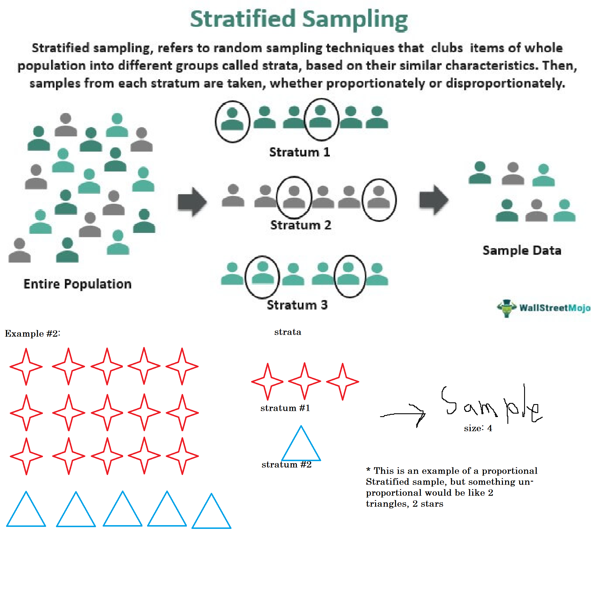
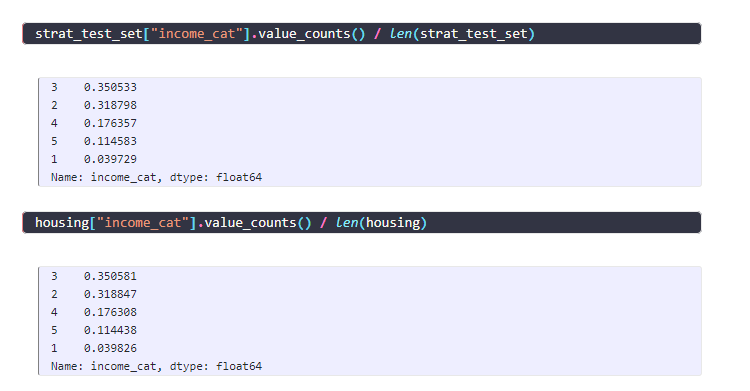
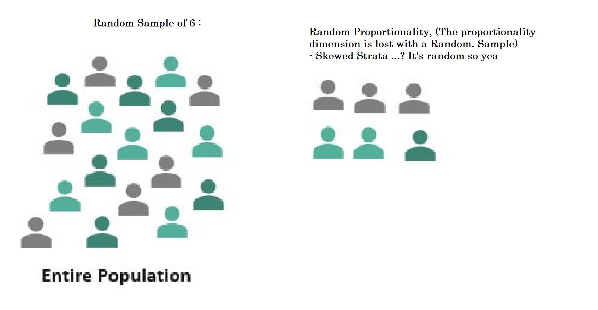

## Stratified Sampling:



[WallStreetMojo - Stratified Sampling | Example #.1 Source](https://www.wallstreetmojo.com/stratified-sampling/)

```python
from sklearn.model_selection import StratifiedShuffleSplit

split = StratifiedShuffleSplit(n_splits=1, test_size=0.2, random_state=42)
for train_index, test_index in split.split(dataset, dataset["income"]):
    strat_train_set = dataset.loc[train_index]
    strat_test_set = dataset.loc[test_index]
```
[Code Credits from hands-on-ml2-notebooks , CH.2](https://machine-learning-apps.github.io/hands-on-ml2/02_end_to_end_machine_learning_project)

- `test_size` refers to the amount of the dataset you're sub-setting (here it's set to 20%)
- `random_state` is an optional parameter that's great to use as static seed, and replicate a certain pattern of randomness again. *(E.G: I got 2 datasets, data and labels, with the same size and indices, I can just both Shuffle them by the same seed, and they will match!)*

In the **for loop**, Iterating over the Stratified Split data specifically by the `income` parameter, so it will basically sample an income distribution proportional to our dataset. *(For the the `strat_train_set` Stratified Training Dataset, & `strat_test_set` Stratified Test Dataset)*

**Notice how both stratified datasets have similar proportions :D**



## Random Sampling:



```python
import numpy as np

# For illustration only. Sklearn has train_test_split()
def split_train_test(data, test_ratio):
    shuffled_indices = np.random.permutation(len(data))
    test_set_size = int(len(data) * test_ratio)
    test_indices = shuffled_indices[:test_set_size]
    train_indices = shuffled_indices[test_set_size:]
    return data.iloc[train_indices], data.iloc[test_indices]
```

- This block of code is basically equivalent to Sklearn's random test set splitter.
- Uses NumPy to get permutation of the data (randomly sorted), then splits to at `test_ratio` and returns.

**Behold, the Sklearn equivalent:** 

```python
from sklearn.model_selection import train_test_split

train_set, test_set = train_test_split(housing, test_size=0.2, random_state=42)
```

- Notice that we can also use the `random_state` param again for replicable randomness!